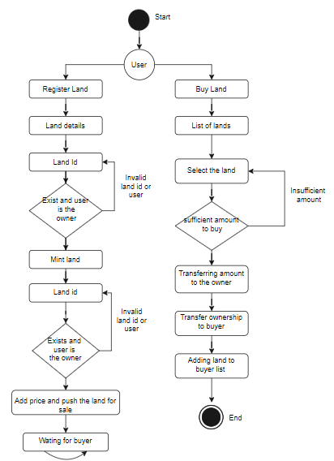
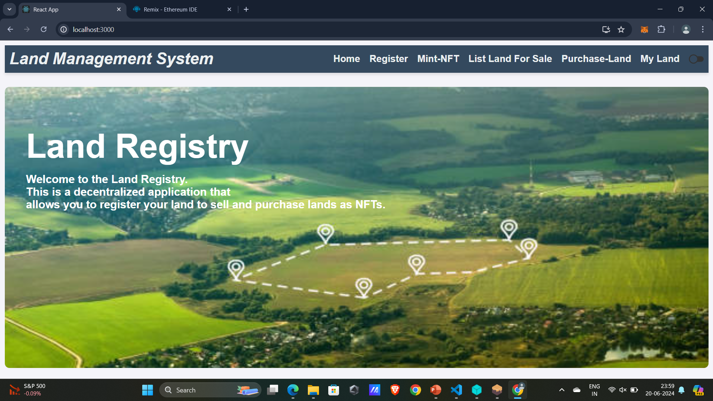
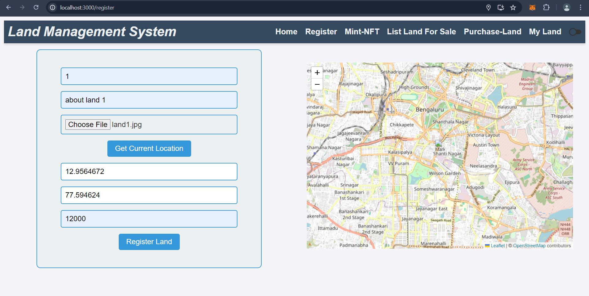
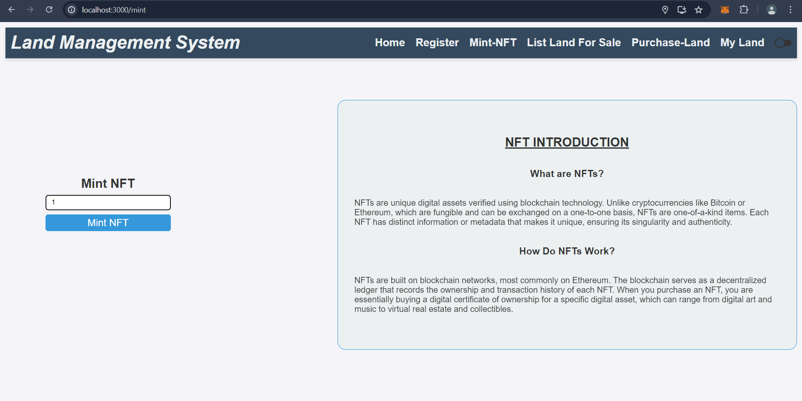
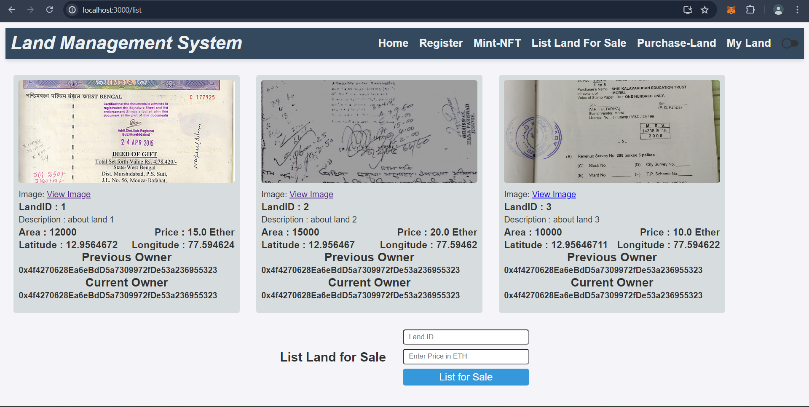
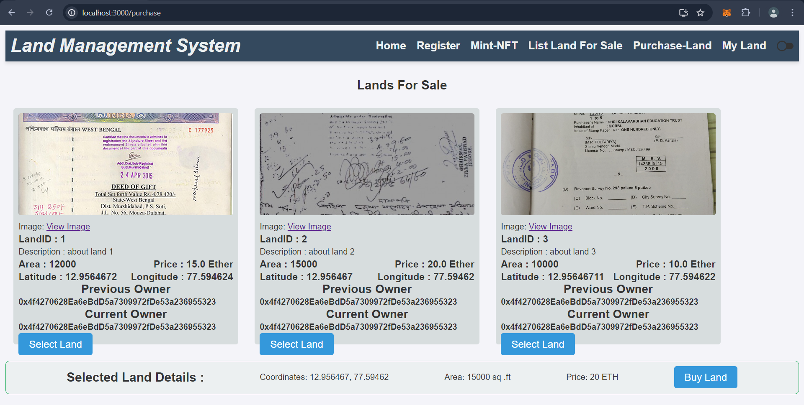
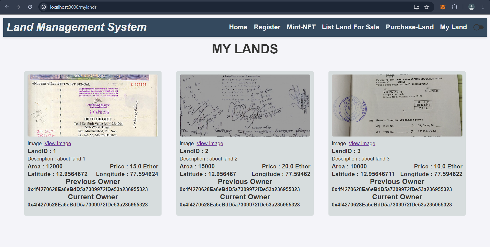

# Land Management System Using NFTs

## Project Description

This application aims to revolutionize the traditional land registration system by leveraging blockchain technology. The current land registration process, particularly in India, is often slow, inconvenient, and prone to fraud. Our system addresses these issues by providing a distributed, secure, and transparent platform for land transactions.

## Features
1) Land Registration: Owners can register their land, converting each land parcel into an NFT (Non-Fungible Token).
2) Land Listing: Tokenized land parcels can be listed for sale with specified amounts.
3) Secure Transactions: Buyers can purchase land parcels securely through the platform.
4) Resale: Owners can re-sell their land parcels in the future with new specified amounts.
5) Fraud Prevention: The use of blockchain ensures that all transactions are transparent and immutable, significantly reducing the risk of fraud.
6) Efficiency: The decentralized nature of the system accelerates the registration process and reduces paperwork.

*Figure 1: Represent the activity diagram of Land Management System illustrates the workflow of a decentralized land ownership and trading system using blockchain and NFTs, comprising two main processes: registering land and buying land.*

## Technologies Used

### Frontend
1) JavaScript
2) React Framework
3) CSS
4) MetaMask Chrome Extension

### Backend
1) Ethereum Blockchain (Truffle Suite)
2) Solidity
3) Ganache
4) Web3
5) IPFS Desktop

## Getting Started

### Prerequisites

1) Node.js: Ensure you have Node.js installed on your machine.
2) MetaMask: Install the MetaMask extension on your Chrome browser.
3) Ganache: Download and install Ganache for local blockchain development.
4) IPFS(Interplanetary File System): Download and install IPFS for Desktop for uploading the document hash value.

## Installation

1) Clone the repository:
   git clone https://github.com/yourusername/land-management-system-nft.git
   cd land-management-system-nft

2) Install dependencies:
   npm install
   
3) Compile and deploy contracts:
   a) Ensure Ganache is running, then:
   truffle compile
   truffle migrate

4) Start the development server:
   a) Ensure IPFS is running, then:
   npm start

## Configuration

### MetaMask Configuration:
Connect MetaMask to your local blockchain (usually at http://127.0.0.1:7545 because we are using Ganache).
Import accounts from Ganache to MetaMask.

### IPFS Configuration:

Ensure IPFS Desktop is installed and running.
Configure IPFS to store land parcel data.

## Usage

1) Register Land: Owners can register their land by filling out the necessary details. Each land parcel is converted into an NFT.
2) List Land for Sale: Owners can list their tokenized land parcels for sale with a specified amount.
3) Buy Land: Interested buyers can purchase listed land parcels if suffecient amount is available then successful transfer for land parcel to buyer account.
4) Re-sell Land: Owners can re-sell their land parcels at any time by specifying a new amount.

## Results

## Contact
For any questions or feedback, please contact suresh.bhajantri.h@gmail.com.
